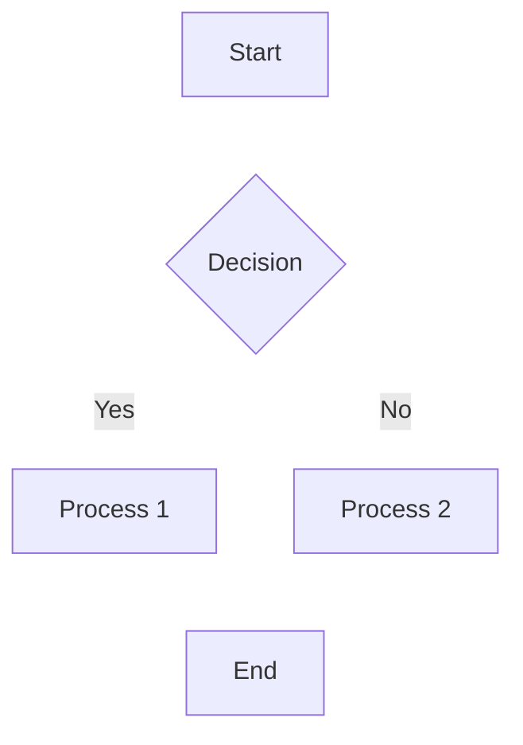

Title: Markdown Extra Example

----

Read: docs/example

----

Text:
# Markdown Demo Page

This page demonstrates all well-known markdown and markdown extra elements.

## Table of Contents

- [Headers](#headers)
- [Text Formatting](#text-formatting)
- [Lists](#lists)
- [Links and Images](#links-and-images)
- [Code](#code)
- [Tables](#tables)
- [Blockquotes](#blockquotes)
- [Horizontal Rules](#horizontal-rules)
- [HTML Elements](#html-elements)
- [Markdown Extra Features](#markdown-extra-features)

## Headers

# Header 1
## Header 2
### Header 3
#### Header 4
##### Header 5
###### Header 6

Not allowed: `Alternative H1` or `Alternative H2`

## Text Formatting

**Bold text** or __bold text__

*Italic text* or _italic text_

***Bold and italic*** or ___bold and italic___

~~Strikethrough text~~

==Highlighted text== (if supported)

Subscript: H~2~O

Superscript: X^2^

## Lists

### Unordered Lists

- Item 1
- Item 2
  - Subitem 2.1
  - Subitem 2.2
    - Sub-subitem 2.2.1
- Item 3

Alternative syntax:
* Item A
* Item B
  + Subitem B.1
  + Subitem B.2

### Ordered Lists

1. First item
2. Second item
   1. Subitem 2.1
   2. Subitem 2.2
3. Third item

### Task Lists

- [x] Completed task
- [ ] Incomplete task
- [x] Another completed task

### Definition Lists

Term 1
:   Definition 1

Term 2
:   Definition 2a
:   Definition 2b

## Links and Images

### Links

[Inline link](https://example.com)

[Link with title](https://example.com "Example Website")

[Reference link][1]

[Another reference link][reference]

<https://example.com>

[1]: https://example.com
[reference]: https://example.com "Reference Link"

### Images


![Reference image][image-ref]

[image-ref]: https://via.placeholder.com/300x200 "Reference Image"

## Code

### Inline Code

Use `inline code` for small snippets.

### Code Blocks

```
Plain code block
No syntax highlighting
```

```javascript
// JavaScript code block
function greet(name) {
    console.log(`Hello, ${name}!`);
}
```

```python
# Python code block
def fibonacci(n):
    if n <= 1:
        return n
    return fibonacci(n-1) + fibonacci(n-2)
```

```sql
-- SQL code block
SELECT id, name, email
FROM users
WHERE active = 1;
```

### Code with Line Numbers

```javascript {.line-numbers}
function calculateSum(a, b) {
    const result = a + b;
    return result;
}
```

## Tables

### Simple Table

| Header 1 | Header 2 | Header 3 |
|----------|----------|----------|
| Cell 1   | Cell 2   | Cell 3   |
| Cell 4   | Cell 5   | Cell 6   |

### Table with Alignment

| Left Aligned | Center Aligned | Right Aligned |
|:-------------|:--------------:|--------------:|
| Left         | Center         | Right         |
| Text         | Text           | Text          |
| More         | More           | More          |

### Table with Complex Content

| Feature | Markdown | Markdown Extra |
|---------|:--------:|:--------------:|
| **Bold** | ✓ | ✓ |
| *Italic* | ✓ | ✓ |
| `Code` | ✓ | ✓ |
| ~~Strike~~ | ✓ | ✓ |
| Tables | ✓ | ✓ |
| Footnotes | ✗ | ✓ |

## Blockquotes

> This is a simple blockquote.

> This is a blockquote
> that spans multiple lines.

> ## Blockquote with header
> 
> This blockquote contains other markdown elements:
> 
> - List item 1
> - List item 2
> 
> **Bold text** in blockquote.

> Level 1 quote
> > Level 2 nested quote
> > > Level 3 nested quote

## Horizontal Rules

---

***

___

- - -

* * *

## HTML Elements

<div class="custom-class">
    <p>HTML elements can be used in markdown.</p>
    <strong>Bold HTML</strong> and <em>italic HTML</em>.
</div>

<details>
<summary>Collapsible section</summary>

This content is hidden by default and can be expanded.

- Hidden list item 1
- Hidden list item 2

</details>

<kbd>Ctrl</kbd> + <kbd>C</kbd> to copy

<mark>Highlighted text with HTML</mark>

## Markdown Extra Features

### Footnotes

This text has a footnote[^1].

Another footnote reference[^note].

[^1]: This is the first footnote.
[^note]: This is another footnote with a custom name.

### Abbreviations

*[HTML]: Hyper Text Markup Language
*[CSS]: Cascading Style Sheets

The HTML and CSS specifications are maintained by W3C.

### Special Attributes

#### Headers with IDs {#custom-header-id}

#### Emphasis with Classes {.class-name}

#### Links with Attributes

[Link with attributes](https://example.com){.external target="_blank"}

### Math (if supported)

Inline math: $E = mc^2$

Block math:
$$
\int_{-\infty}^{\infty} e^{-x^2} dx = \sqrt{\pi}
$$

### Mermaid Diagrams (if supported)



### Emoji (if supported)

🙂 🥳 👍 🚀 🌟

### Special Characters and Escaping

\*Not italic\*

\`Not code\`

\\Backslash

\# Not a header

### Line Breaks

This line ends with two spaces  
And this is a new line.

This line ends with a backslash\
And this is also a new line.

---

*This comprehensive demo showcases the full range of markdown and markdown extra capabilities.*