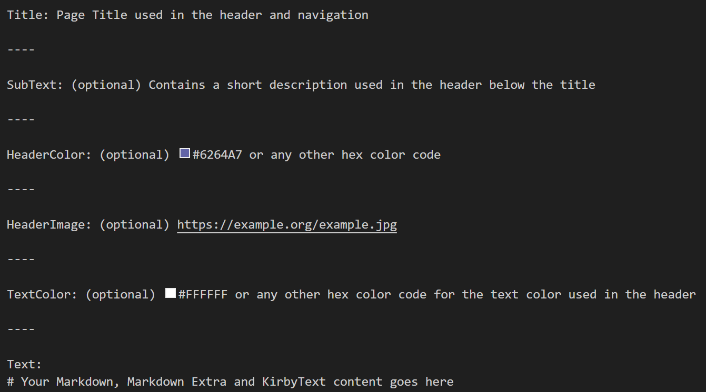

Title: Example Documentation

----

Text:

## Source Code
The source code of this documentation is available on GitHub:  
[https://github.com/id-unibe-ch/example-doc](https://github.com/id-unibe-ch/example-doc)

## File naming
See [File naming and handling](./files/) for more information about file naming conventions and handling of multilingual content.

## Folder structure
See [Folder naming and handling](./folders/) for more information about folder naming conventions and structures.

## Images
See [Image handling and usage](./page-elements/images/) for more information about image handling and usage in the documentation.

## Page structure
Each documentation page must have the following structure:  

!!! info ""

    Unused sections may be removed, for example if you do not want to have a subtext,
    just remove the whole section including the `----` lines.

  
!!! warning "Main Page Uuid"

    Make sure to set a `Uuid` field on the main page of your documentation.  
    This is required for referencing the documentation from the static page.  
    Take the [Example Documentation main page](https://github.com/id-unibe-ch/example-doc/blob/main/docs/doc.de.md?plain=1) as reference.
    Subpages do not need to have a `Uuid` field as it will be created automatically by Kirby CMS.

----

Uuid: unibe-doc-example

----